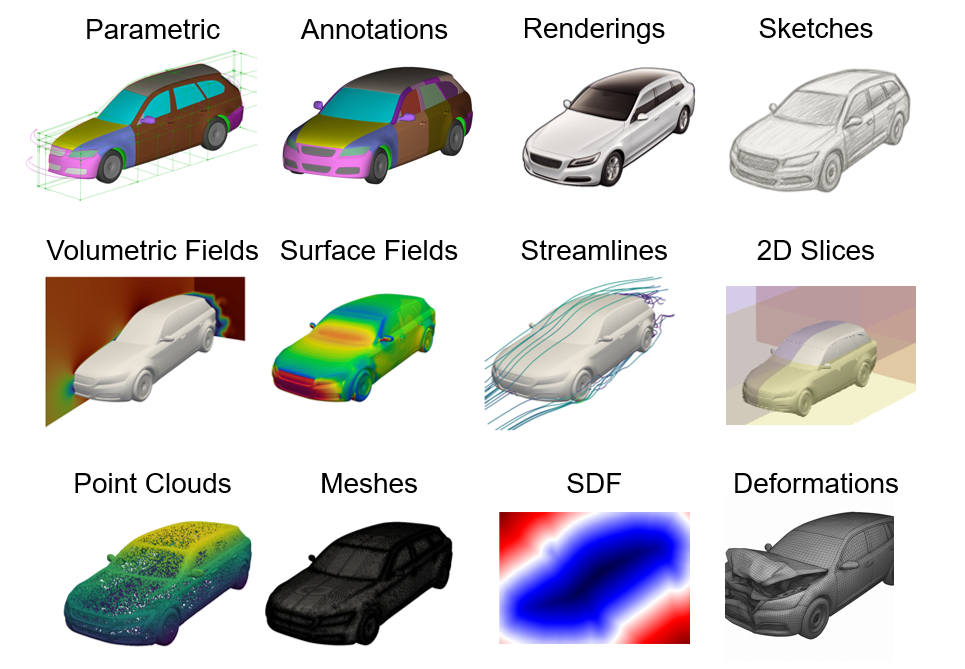

.. title:: Writing Parallel Files

Optimizing CAE Dataset Storage with PyVista
===========================================

PyVista can read all of `VTK's File Formats <https://docs.vtk.org/en/latest/vtk_file_formats/index.html>`_ and many others that are supported by `meshio <https://github.com/nschloe/meshio>`_. However, at the time of writing this, PyVista lacks the support to write out VTK parallel files and this became an issue when needing to process datasets at the TB scale.

The Dataset
-----------

Computer aided engineering (CAE) datasets are huge and are only going to get larger as model sizes increase and as industury moves more towards simulation and automation. Moreover, CAE datasets are increasingly being used to train machine learning (ML) models and, as `well established <https://asmedigitalcollection.asme.org/mechanicaldesign/article/147/4/040301/1212567/Special-Issue-Design-by-Data-Cultivating-Datasets>`_, ML is highly dependent on high quality, large, and diverse public datasets.

The aforementioned article, `Special Issue: Design by Data: Cultivating Datasets for Engineering Design <https://asmedigitalcollection.asme.org/mechanicaldesign/article/147/4/040301/1212567/Special-Issue-Design-by-Data-Cultivating-Datasets>`_ includes a variety of CAE results including `DrivAerML <https://caemldatasets.org/drivaerml/>`_, a a high-fidelity open-source (CC-BY-SA) public dataset for automotive aerodynamics using 500 parametric morphed. This dataset can be downloaded directly from Hugging Face at `neashton/drivaerml <https://huggingface.co/datasets/neashton/drivaerml>`_, is an enormous 31 TB. This is one of the key issues with CAE datasets: high fidelity solutions often require many analyses and each analysis generates many Gigabytes of intermediate solutions. These results, from `OpenFOAM <https://www.openfoam.com/>`_ have been stored as VTU files as these are `Unstructured Grids <https://vtk.org/doc/nightly/html/classvtkUnstructuredGrid.html>`_.

To process even a `single run <https://huggingface.co/datasets/neashton/drivaerml/tree/main/run_1>`_ of this dataset is requires downloading 51 GB, stored across two split ``.vtu`` files:

.. code:: bash

   volume_1.vtu.00.part
   volume_1.vtu.01.part

These files were split not according to any `VTK <https://vtk.org/>`_ scheme but most likely due to Hugging Face's `Storage Limits <https://huggingface.co/docs/hub/storage-limits>`_, which requires you to first download and concatenate the two files. Here we download the split ``.vtu`` files from `drivaerml Run 1 <https://huggingface.co/datasets/neashton/drivaerml/tree/main/run_1>`_ and then concatenate them into a single file, `volume_1.vtu`:

.. code:: bash

   wget -O volume_1.vtu.00.part "https://huggingface.co/datasets/neashton/drivaerml/resolve/main/run_1/volume_1.vtu.00.part?download=true"
   wget -O volume_1.vtu.01.part "https://huggingface.co/datasets/neashton/drivaerml/resolve/main/run_1/volume_1.vtu.01.part?download=true"
   cat volume_1.vtu.00.part volume_1.vtu.01.part > volume_1.vtu
   
This dataset contains around 160 million cells, and loading it on my machine (Intel i9-14900KF, Samsung 990 2TB) takes an excessively long time, nearly three minutes.

.. code:: pycon

   >>> import time
   >>> import pyvista as pv
   >>> tstart = time.time()
   >>> grid = pv.read("./drivaer_data/run_1/volume_1.vtu")
   >>> print(f"Time to read original vtu: {time.time() - tstart:.1f} seconds")
   Time to read original vtu: 163.6 seconds

The fastest we could expect to read this dataset from disk based on timings
from `fio <https://github.com/axboe/fio>`_ (see timing code below) is around
20.4 seconds (51 GB divided by 2.5 GB/s). Clearly there's another bottleneck,
and looking at ``htop``, we can tell this is a single threaded CPU bound task.

.. collapse:: Read/Write Timing code

   .. code:: bash

      $ fio --name=readtest --filename=/tmp/tempfile --rw=read --bs=1M --s  
      READ: bw=2536MiB/s (2659MB/s), 2536MiB/s-2536MiB/s (2659MB/s-2659MB/s), io=149GiB (160GB), run=60001-60001msec
      $ fio --name=writetest --filename=/tmp/tempfile --rw=write --bs=1M -
      WRITE: bw=2874MiB/s (3014MB/s), 2874MiB/s-2874MiB/s (3014MB/s-3014MB/s), io=168GiB (181GB), run=60001-60001msec

First, let's see if we can improve the read/write performance by switching over
to a different file or compression type using VTK/PyVista.

Comparing File Types and Compression
------------------------------------

Let's compare the legacy, XML, and VTKHDF readers/writers supported for an `UnstructuredGrid <https://vtk.org/doc/nightly/html/classvtkUnstructuredGrid.html`>_. Referencing `VTK's File Formats <https://docs.vtk.org/en/latest/vtk_file_formats/index.html>`_, the following file types should work for our dataset: `.vtk` (legacy), `.vtu` (XML), and VTKHDF (at the time of writing this, incomplete).

Additionally, the XML format supports four different types of compression, see `vtkXMLWriterBase <https://vtk.org/doc/nightly/html/classvtkXMLWriterBase.html#ac7b451f43b9be0bd65028cb5659446ce>`_.

First, to speed up the timing and compression tests, let's extract the first
million cells from this dataset:

.. code:: pycon

   >>> grid_sub = grid.extract_cells(range(1_000_000))
   >>> grid_sub
   UnstructuredGrid (0x7f580e1f9420)
     N Cells:    1000000
     N Points:   1127098
     X Bounds:   -4.720e-01, 5.040e-01
     Y Bounds:   -2.810e-01, 8.389e-01
     Z Bounds:   -3.176e-01, 1.524e-01
     N Arrays:   23

Next, let's write out in three file formats and with all four types of
compression for the XML format. This requires the as of yet unreleased
``pyvista>=0.47.0`` which you can use by installing the latest from ``main``:

.. collapse:: Timing code

   .. code:: pycon
   
      print("Legacy VTK reader/writer")
      filename = "/tmp/tmp-grid.vtk"
      tstart = time.time()
      grid_sub.save(filename)
      print(f"    Time to save: {time.time() - tstart:.1f} seconds")
   
      tstart = time.time()
      pv.read(filename)
      print(f"    Time to load: {time.time() - tstart:.1f} seconds")
      file_size = Path(filename).stat().st_size
      print(f"    File size:    {file_size / 1024**2:.1f} MB")
      print()
      print()
   
      print("VTK XML reader/writer")
      filename = "/tmp/tmp-grid.vtu"
      for compression in ["zlib", "lz4", "lzma", None]:
          print(f"Compression: {compression}")
      
          tstart = time.time()
          grid_sub.save(filename, compression=compression)
          print(f"    Time to save: {time.time() - tstart:.1f} seconds")
      
          tstart = time.time()
          pv.read(filename)
          print(f"    Time to load: {time.time() - tstart:.1f} seconds")
          file_size = Path(filename).stat().st_size
          print(f"    File size:    {file_size / 1024**2:.1f} MB")
          print()
   
      print("VTKHDF reader/writer")
      filename = "/tmp/tmp-grid.vtkhdf"
      tstart = time.time()
      grid_sub.save(filename)
      print(f"    Time to save: {time.time() - tstart:.1f} seconds")
      
      tstart = time.time()
      pv.read(filename)
      print(f"    Time to load: {time.time() - tstart:.1f} seconds")
      file_size = Path(filename).stat().st_size
      print(f"    File size:    {file_size / 1024**2:.1f} MB")
      print()
      print()

.. code:: bash

   Legacy VTK reader/writer
       Time to save: 0.6 seconds
       Time to load: 0.2 seconds
       File size:    284.6 MB

   VTK XML reader/writer
   Compression: zlib
       Time to save: 4.7 seconds
       Time to load: 1.7 seconds
       File size:    253.2 MB
   
   Compression: lz4
       Time to save: 1.0 seconds
       Time to load: 1.1 seconds
       File size:    311.9 MB
   
   Compression: lzma
       Time to save: 28.2 seconds
       Time to load: 7.2 seconds
       File size:    220.9 MB
   
   Compression: None
       Time to save: 1.1 seconds
       Time to load: 1.4 seconds
       File size:    405.6 MB
   
   VTKHDF reader/writer
       Time to save: 0.1 seconds
   
   ... Process Python segmentation fault (core dumped)

VTK supports a wide variety of formats, from the legacy ``*.vtk`` to the new XML formats which include both serial and parallel formats. Repeating VTK's `XML File Formats <https://docs.vtk.org/en/latest/vtk_file_formats/vtkxml_file_format.html>`_:

- ``(.vti)`` - Serial `vtkImageData <https://vtk.org/doc/nightly/html/classvtkImageData.html>`_
- ``(.vtp)`` - Serial `vtkPolyData <https://vtk.org/doc/nightly/html/classvtkPolyData.html>`_
- ``(.vtr)`` - Serial `vtkRectilinearGrid <https://vtk.org/doc/nightly/html/classvtkRectilinearGrid.html>`_
- ``(.vts)`` - Serial `vtkStructuredGrid <https://vtk.org/doc/nightly/html/classvtkStructuredGrid.html>`_
- ``(.vtu)`` - Serial `vtkUnstructuredGrid <https://vtk.org/doc/nightly/html/classvtkUnstructuredGrid.html>`_
- ``(.pvti)`` - Parallel `vtkImageData <https://vtk.org/doc/nightly/html/classvtkImageData.html>`_
- ``(.pvtp)`` - Parallel `vtkPolyData <https://vtk.org/doc/nightly/html/classvtkPolyData.html>`_
- ``(.pvtr)`` - Parallel `vtkRectilinearGrid <https://vtk.org/doc/nightly/html/classvtkRectilinearGrid.html>`_
- ``(.pvts)`` - Parallel `vtkStructuredGrid <https://vtk.org/doc/nightly/html/classvtkStructuredGrid.html>`_
- ``(.pvtu)`` - Parallel `vtkUnstructuredGrid <https://vtk.org/doc/nightly/html/classvtkUnstructuredGrid.html>`_

